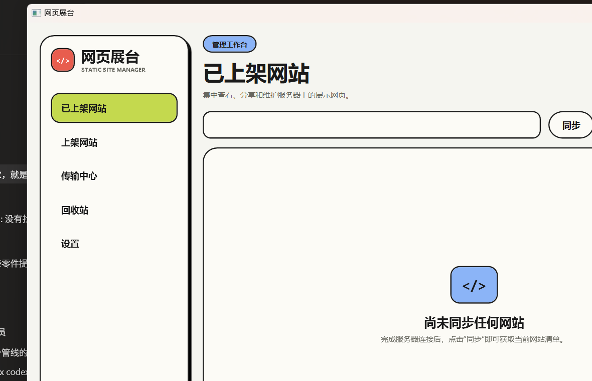
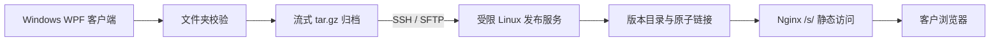
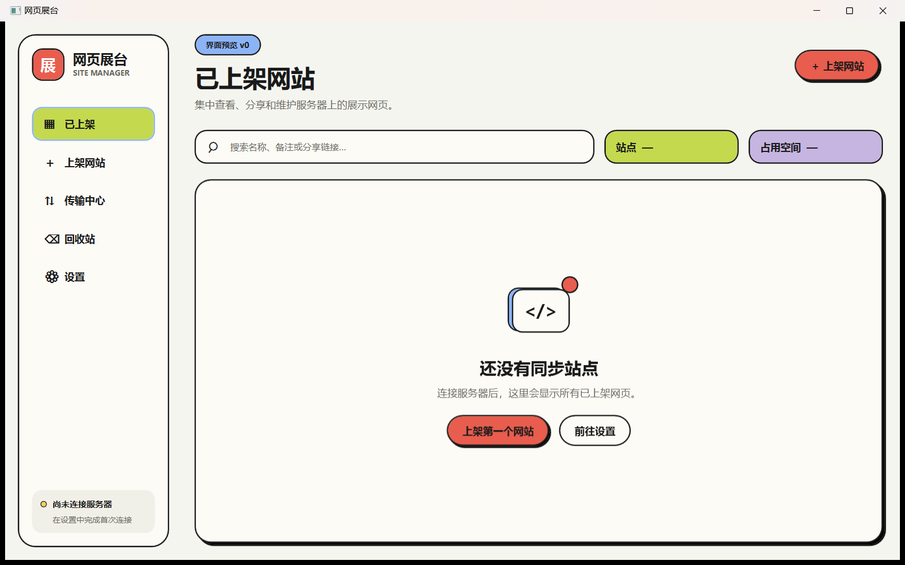

<p align="center">
  
</p>

<h1 align="center">网页展台 · Static Site Manager</h1>

<p align="center">把本地静态网页安全发布到自托管服务器，生成可直接分享的浏览器链接。</p>


“网页展台”是一款 Windows WPF 桌面软件：选择已经制作好的静态网页文件夹，通过 SSH/SFTP 发布到自己的 Linux 服务器，再把浏览器链接分享给客户或同事。访问者不需要安装 3D、视频或设计软件。

<p align="center">
  
</p>

上图是当前界面预览：左侧集中管理已上架网站、上架流程、传输中心、回收站和设置，右侧展示站点清单与服务器状态。

## 能做什么

| 能力 | 说明 |
| --- | --- |
| 发布静态网站 | 扫描 `index.html`、敏感文件、符号链接和 2 GiB 大小限制 |
| 大文件续传 | 归档后通过 SFTP 分块上传，服务端 `.partial` 文件支持断点续传 |
| 更新与版本 | 更新使用原站点 ID 和 slug，公开链接保持不变，并通过原子切换保护旧版本 |
| 站点管理 | 同步、搜索、复制链接、浏览器打开、回收、恢复和永久清理 |
| 传输历史 | 查看当前阶段、字节进度，以及成功/失败/取消记录 |
| 本地缓存 | 启动先显示最近同步结果，后台再与服务器同步；本地目录历史不上传服务器 |
| 安全连接 | SSH 主机指纹校验、受限发布用户、私钥只读取本机路径 |

## 工作方式



管理面只走 SSH/SFTP，不在公网暴露管理 API；公网只提供 `/s/<slug>/` 静态内容。

## 界面预览

<p align="center">
  
</p>

界面采用高对比描边、珊瑚红主操作、天蓝状态和大留白卡片，适合在展示前快速确认站点状态与分享链接。

## 快速开始

### 1. 准备服务器

服务器需要一个可以执行受限发布命令的 Linux 用户、SSH 公钥登录、SFTP 权限，以及负责 `/s/` 静态目录的 Nginx。部署脚本和服务端实现位于：

- `deploy/`：Nginx、systemd 和安装脚本
- `server/`：受限 `site-managerctl` 发布服务
- `docs/03-服务器发布服务.md`：目录、权限和清理策略
- `docs/04-SSH发布协议.md`：客户端与服务端协议

### 2. 配置客户端

复制 `config/settings.example.json` 到：

```text
%APPDATA%\SiteManager\settings.json
```

然后填写服务器地址、SSH 用户、私钥路径、主机指纹和公开基础 URL。私钥文件只保留在本机，不要复制到仓库、安装包或服务器。

### 3. 构建和运行

```powershell
dotnet test -c Release
dotnet run --project src/SiteManager.App/SiteManager.App.csproj
```

生成 Windows x64 自包含包：

```powershell
.\scripts\publish-win-x64.ps1
```

发布脚本会先运行测试，再生成 `artifacts/` 下的 EXE、ZIP 和 SHA-256 校验文件。构建产物被 `.gitignore` 排除，不会进入公共仓库。

## 安全边界

- 仓库不包含私钥正文、密码、令牌、本机 `settings.json`、SQLite 缓存、传输历史或构建产物。
- `.gitignore` 明确排除私钥扩展名、SSH 私钥文件名、应用配置、缓存、归档、`bin/`、`obj/` 和 `artifacts/`。
- 客户端校验 SSH 主机指纹；指纹不匹配时连接中止。
- 服务端使用受限账户和独立目录，公开 Nginx 只响应 `/s/`，不开放管理 API。
- 公开仓库只保存示例配置。部署时请替换示例主机、用户、指纹和 URL，并在发生泄露时立即轮换密钥。

发现安全问题请参阅 [SECURITY.md](SECURITY.md)，不要在公开 Issue 中发布密钥或服务器凭据。

## 开发与测试

项目按分层结构组织：

```text
src/SiteManager.Core             领域模型、校验、发布编排、协议
src/SiteManager.Infrastructure   SSH/SFTP、归档、SQLite、JSON 存储
src/SiteManager.App              WPF 视图、资源和 ViewModel
server/                           Linux 发布服务与清理生命周期
tests/                            .NET、基础设施和服务端测试
docs/                             架构、协议、部署和设计文档
```

本地检查：

```powershell
dotnet test -c Release
python -m unittest discover -s server/tests -p "test_*.py"
```

## 文档

- [文档索引](docs/00-索引.md)
- [系统架构](docs/01-系统架构.md)
- [Windows 客户端](docs/02-Windows客户端.md)
- [服务器发布服务](docs/03-服务器发布服务.md)
- [SSH 发布协议](docs/04-SSH发布协议.md)
- [配置与部署](docs/08-配置与部署.md)

## 许可证

本项目采用 [MIT License](LICENSE)。
